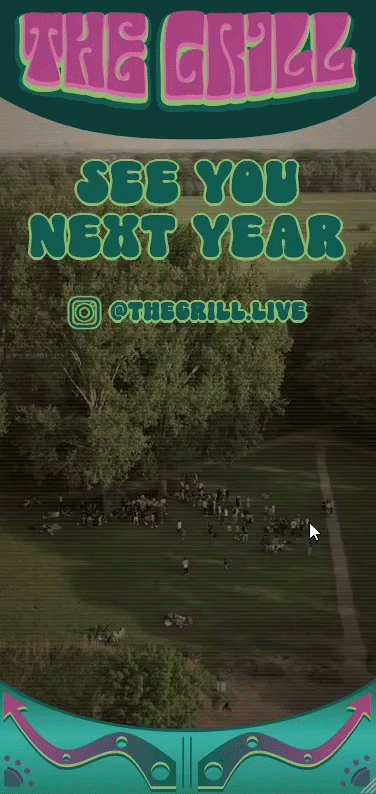

<table>
  <tr>
    <td valign="top">
      <h1>The Grill 2026</h1>
      

        This website was created as an invitation to the TU Delft Grill on the 1st of May. The Grill is an event taking place on a sunny day in Hondenstrandje, Delftse Hout, where people grill, drink beer, and sometimes swim with dogs.
      

      

        I helped build the website, but the real credit goes to the organizers who put the event together every year. Thank you to them, and hope to see you next year!
      

      <ul>
        <li>Instagram: <a href="https://www.instagram.com/thegrill.live/">@thegrill.live</a></li>
        <li>Aftermovie: <a href="https://www.youtube.com/watch?v=fGfECDaROj0">@Alex Despan</a></li>
        <li>Original Repository: <a href="https://github.com/Gargant0373/TheGrill">@Gargant0373</a></li>
      </ul>
      <h2>Getting started</h2>
      

        You need <a href="https://nodejs.org/">Node.js</a> 20.19 or newer. Clone the repository, install the dependencies and start the dev server:
      

      <pre><code>git clone https://github.com/33ferero/TheGrill2026.git
cd TheGrill2026
npm install
npm run dev</code></pre>
      
The site is then running at http://localhost:5173 and reloads as you edit.

    </td>
    <td valign="middle" align="center" width="260">
      
    </td>
  </tr>
</table>
